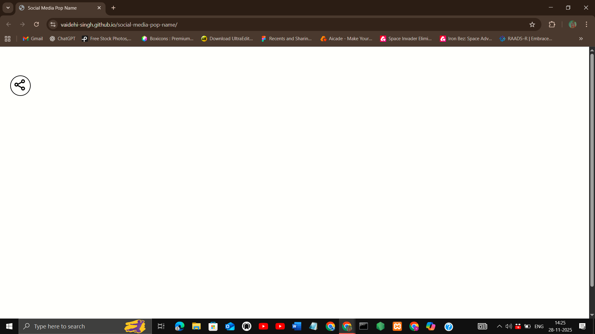
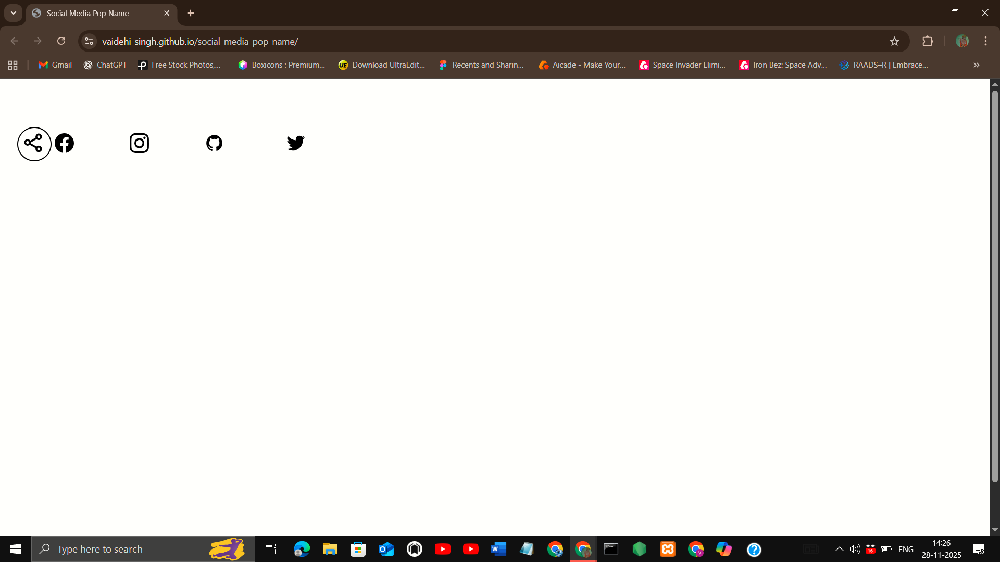
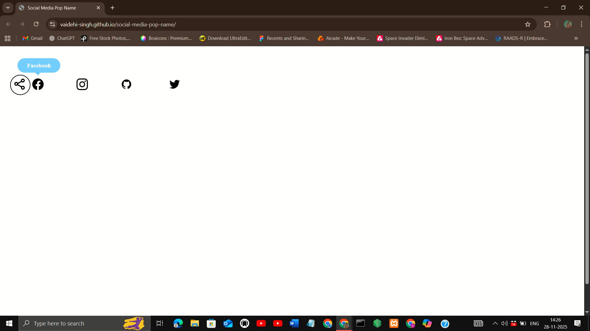
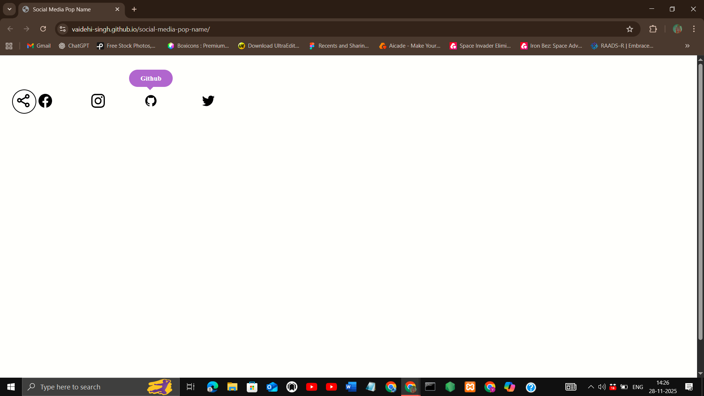

## Project Title
Social Media Pop Name

## Description
An interactive social media pop‑up name feature built with HTML, CSS, and JavaScript. It displays platform names with smooth hover, offering a stylish way to highlight social icons and enhance user engagement on modern websites.

## Features
- Responsive design (mobile, tablet, desktop)
- Smooth transitions and animations
- Clean, modern UI
- Interactive hover effects for social icons

## Demo
[Live Demo](https://vaidehi-singh.github.io/social-media-pop-name/)

## Screenshots





## Tech Stack
- HTML
- CSS
- JavaScript

## How to Use
 1. Clone the repo  
   ```bash
   git clone https://github.com/vaidehi-singh/social-media-pop-name.git
   cd social-media-pop-name
   ```
 2. Open index.html in your browser.

## Author
Designed and developed by **Vaidehi Singh**  
[GitHub Profile](https://github.com/vaidehi-singh)
